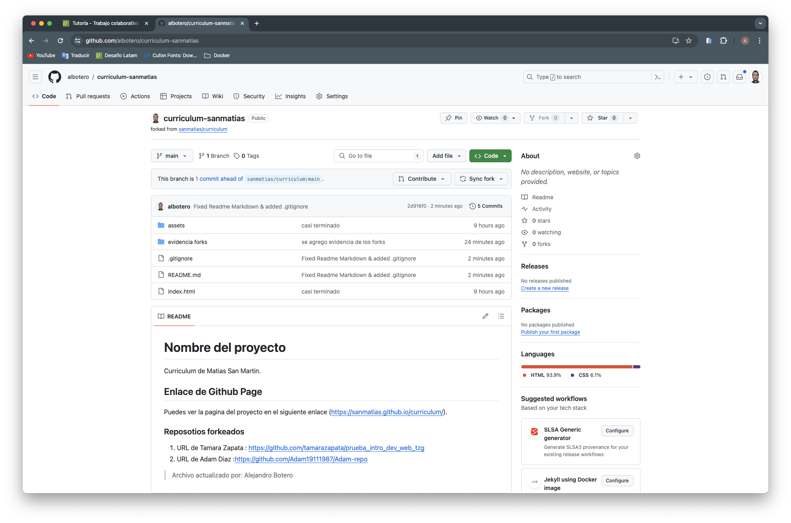
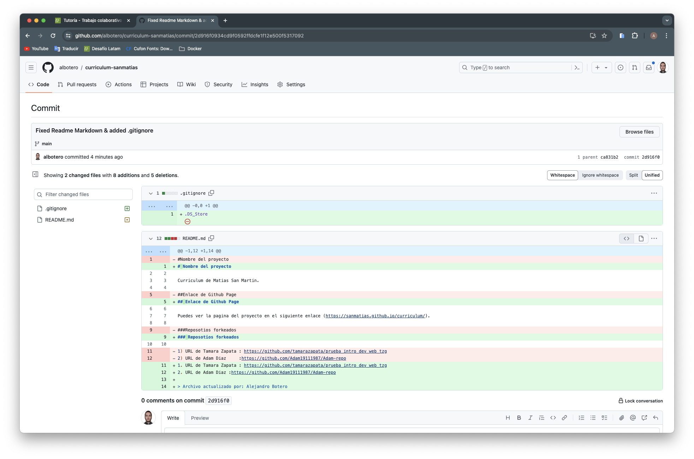
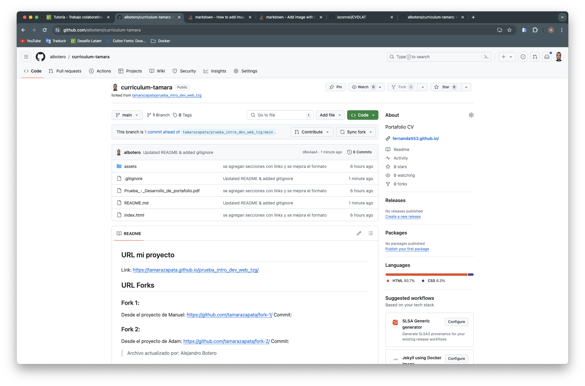
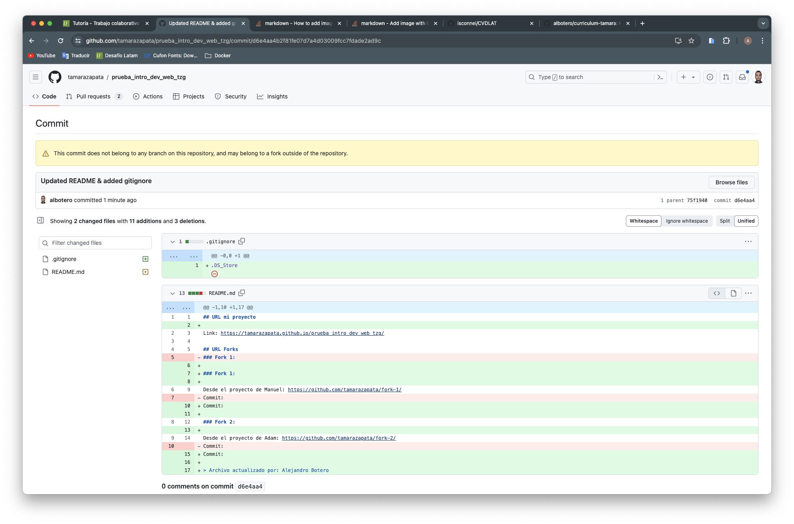

# Curriculum vitae - Alejandro Botero

## Deploy

Publicado en [github pages](https://albotero.github.io/cv/)

## Forks

### Matías San Martín

- Fork:
  

- Commit:
  

### Tamara Zapata

- Fork:
  

- Commit:
  
